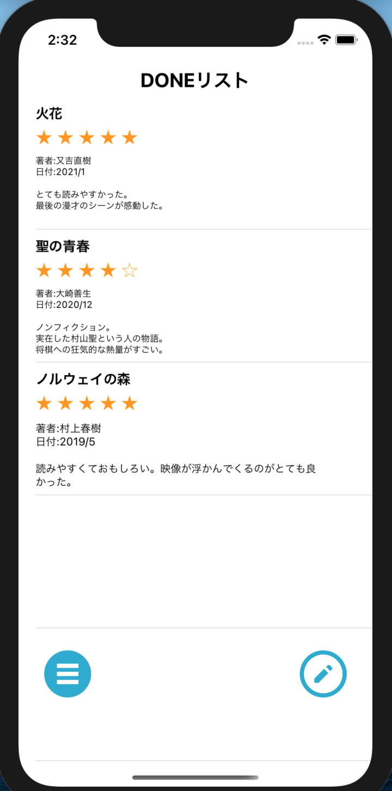
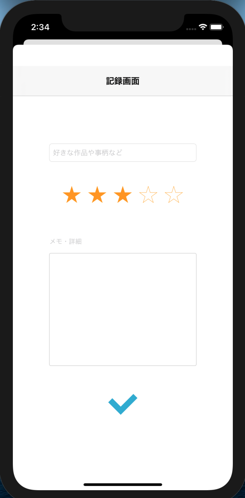

# DONE List

## 概要
Done(やったこと)リストです。 
好きな作品や事柄と、その詳細をリスト化できます。 

## どういうアプリか
何をしている時が楽しいか？と聞かれたときにその数が多ければ 
多い人ほど幸せなのではないか、と思いこのアプリを作りました。 
 
使い方は人それぞれです。 
小説が好きな人であれば、作品名とその詳細をリスト化できます。 
やっていて楽しいことをリスト化したければ、詳細と共に保存できます。 
また、好きな度合いに応じてレーティングもつけることができます。

## デモ

## UI
追加ボタンと編集ボタンを元々NavigationBarにつけていましたが、 
実機で試したところ使いづらかったので、下の方につけています。 
また、追加画面からメイン画面へ戻る際はフルスクリーンだと上の「戻る」 
ボタンを押す必要があったので、下へスライドすれば戻れるようにしています。

## 機能一覧
・レーティング 
・セル削除 
・セル並び替え 
・リストの保存
